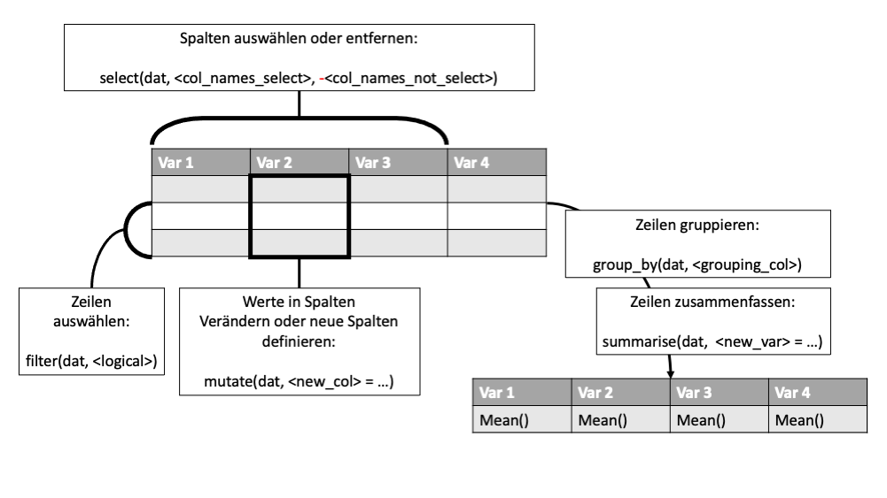

Datenaufbereitung mit dplyr
================
Jan Killisch
2024-10-22

In this document, I show some basics of dplyr and prepare an empirical
dataset for students participating in a university course of mine. Feel
free to submit a pull request if you find an error. Also feel free to
use this document in your own teaching.

It’s all in German at the moment. Sorry about that!

------------------------------------------------------------------------

# Vorbereitung Ihrer Arbeitsumgebung

## Working Directory

Im ersten Schritt legen Sie das *working directory* fest. Das ist der
Ordner, in dem sich später Ihre Skripte, Daten, exportierten Plots,
Dateien usw. befinden werden. Es ist sinnvoll, die .R-Dateien auf der
obersten Ebene, also direkt im working directory, abzulegen. Darunter
können Sie die Ordner data, plots, resources, notes etc. anlegen. Auf
diese Ordner kann dann mit kurzen relativen Pfaden zugegriffen werden.

``` r
# Set working directory
setwd("/Users/jankillisch/ls_landau/teaching/be1_empra/2024/example_data_prep")
```

Wenn Sie mit sogenannten R-Projekten arbeiten, ist dieser Schritt nicht
notwendig. Ich empfehle jedoch, für die folgenden Analysen zunächst mit
dem working directory zu arbeiten.

Wenn Sie auf einem Windows PC arbeiten, ist es eventuell notwendig, "/" durch "\\" oder "//" zu ersetzen.

## Pakete laden

In der Vorbereitungsphase werden auch Pakete geladen, die später
verwendet werden sollen. Dazu kann der Befehl library() verwendet
werden, z.B. library(dplyr). Dadurch werden die Funktionen des geladenen
Packages verfügbar. Generell ist es ratsam, mit geladenen Paketen
sparsam umzugehen. Je mehr Pakete Sie verwenden, desto wahrscheinlicher
ist es, dass Ihr Skript nach einem Update des entsprechenden Pakets
nicht mehr funktioniert. Außerdem laden Sie mit jedem Paket eine
Vielzahl von Funktionen, die andere Funktionen überschreiben können.
Wenn Sie beispielsweise das Paket dplyr zum Testen laden, wird eine
Warnung angezeigt, dass die Funktionen filter, lag, intersect, setdiff,
setequal und union durch das Paket dplyr überschrieben werden. Wenn Sie
nur eine Funktion aus einem Paket verwenden wollen, z.B. die Funktion
separate aus dem Paket tidyr, ist es effizienter, die Funktion
tidyr::separate explizit aufzurufen, anstatt das ganze Paket zu laden.

Laden Sie zu Beginn alle Pakete, die Sie im weiteren Verlauf des Skripts
benötigen. Ich lade hier die Pakete dplyr, tidyr und ggplot2. Die Pakete
stammen aus dem sogenannten tidyverse:

“*The tidyverse is an opinionated collection of R packages designed for
data science. All packages share an underlying design philosophy,
grammar, and data structures.*”

(<https://www.tidyverse.org/>)

Ein wichtiger Aspekt bei der Verwendung von tidyverse Paketen ist, dass
sie regelmäßigen Änderungen unterliegen. Das bedeutet, dass Code im
tidyverse Stil schneller veraltet als Code, der mit base R geschrieben
wurde. Da die Empra-Analysen nur einmal mit dem erhobenen Datensatz
ausgeführt werden müssen, eignen sich die tidyverse Pakete sehr gut für
diese Art der Analyse. Ich verwende hier die Pakete dplyr und ggplot2.

``` r
# Load packages
library(dplyr)
```

    ## 
    ## Attaching package: 'dplyr'

    ## The following objects are masked from 'package:stats':
    ## 
    ##     filter, lag

    ## The following objects are masked from 'package:base':
    ## 
    ##     intersect, setdiff, setequal, union

``` r
library(tidyr)
library(ggplot2)
```

*dplyr*

Vielleicht haben Sie noch nie mit dplyr gearbeitet. Das ist nicht
schlimm! Die Philosophie von dplyr ist es, mit wenigen Grundfunktionen
und manchmal notwendigen Zusatzfunktionen eine große Menge an
Datenoperationen zu ermöglichen. Wenn Sie die Grundfunktionen
beherrschen, wird Ihnen die Datenaufbereitung in R viel leichter fallen.

*tidyr und ggplot2*

Mit tidyr und ggplot2 können viele verschiedene Plots erzeugt werden.
Hier kann man sich einen Eindruck verschaffen:
<https://r-graph-gallery.com/ggplot2-package.html>. ggplot2 erwartet
Daten im sogenannten long-Datenformat. tidyr ist sehr gut geeignet, um
Datenformate zu konvertieren und für ggplot2 nutzbar zu machen. Deshalb
lade ich die beiden Pakete zusammen.

## Mini Tutorial dplyr

Im Folgenden finden Sie einige Übungen, um sich mit den Grundfunktionen
von dplyr vertraut zu machen.

Sehen Sie sich zunächst dieses Einführungsvideo an:

<https://www.youtube.com/watch?v=Gvhkp-Yw65U>

Nutzen Sie das Video, um zu verstehen, was die Grundfunktionen tun:

- select()

- mutate()

- filter()

- group_by()

- summarise()

In dieser Abbildung sind die Funktionen noch einmal zusammengefasst:



Falls Sie detailliertere Erklärungen der Funktionen benötigen, finden
Sie hier eine passende Playlist:

<https://www.youtube.com/playlist?list=PLyogaPCPr32W9wbszOANRJiAvUbbymcCS>

Los geht’s mit dem Mini-Tutorial! Mit dem folgenden Code speichern Sie
einen Beispieldatensatz im Objekt dat, um die Grundfunktionen von dplyr
zu üben. Der Datensatz iris ist bereits in R integriert und kann
jederzeit über das Wort iris aufgerufen werden. Um mehr über den
Datensatz zu erfahren, verwenden Sie ?iris. Die Bedeutung der Spalten in
iris ist im Folgenden nicht relevant, da es nur um die technische
Funktionsweise der Grundfunktionen von dplyr geht.

``` r
# Load some example data built into R
dat <- iris

# Convert the data to a pretty format typical for dplyr: a tibble
dat <- as_tibble(dat)

# Show the data
dat
```

    ## # A tibble: 150 × 5
    ##    Sepal.Length Sepal.Width Petal.Length Petal.Width Species
    ##           <dbl>       <dbl>        <dbl>       <dbl> <fct>  
    ##  1          5.1         3.5          1.4         0.2 setosa 
    ##  2          4.9         3            1.4         0.2 setosa 
    ##  3          4.7         3.2          1.3         0.2 setosa 
    ##  4          4.6         3.1          1.5         0.2 setosa 
    ##  5          5           3.6          1.4         0.2 setosa 
    ##  6          5.4         3.9          1.7         0.4 setosa 
    ##  7          4.6         3.4          1.4         0.3 setosa 
    ##  8          5           3.4          1.5         0.2 setosa 
    ##  9          4.4         2.9          1.4         0.2 setosa 
    ## 10          4.9         3.1          1.5         0.1 setosa 
    ## # ℹ 140 more rows

Hier wird der Datensatz nach dem Speichern im dat-Objekt in ein
tidyverse-typisches Datenformat, ein sogenanntes tibble, umgewandelt.
tibbles unterscheiden sich kaum von data.frames. Die meisten
Operationen, die Sie von data.frames kennen, können Sie auch auf tibbles
anwenden. Sie werden vielleicht auch feststellen, dass das tibble etwas
übersichtlicher aussieht, wenn Sie es auf der Konsole ausgeben. Schauen
Sie sich das tibble genau an. Wo finden Sie die folgenden Informationen?

- Die Anzahl an Zeilen und Spalten

- Die Namen der ersten Spalten im Datensatz

- Die Datentypen der ersten Spalten im Datensatz

- Die Daten der ersten 10 Beobachtungen im Datensatz

### select()

Zuerst testen wir die Grundfunktion select(). Verwenden Sie zunächst
?dplyr::select und lesen Sie den ersten Abschnitt der Dokumentation.
Scrollen Sie ein wenig durch die folgende Dokumentation und versuchen
Sie einen Eindruck von den Möglichkeiten zu bekommen. Schauen Sie sich
dann die Beispiele im letzten Abschnitt der Dokumentation genauer an.
Wenn Sie fertig sind, können Sie mit den folgenden Übungen beginnen.
Wenn im Kommentar ein “Example” steht, ist der folgende Codeabschnitt
nur als Beispiel gedacht. Wenn im Kommentar ein “Task” steht, ist es
Ihre Aufgabe, den folgenden Code zu vervollständigen.

``` r
# Example: Select the columns Sepal.Length, Sepal.Width, and Petal.Length
dplyr::select(dat, Sepal.Length, Sepal.Width, Petal.Length)
```

    ## # A tibble: 150 × 3
    ##    Sepal.Length Sepal.Width Petal.Length
    ##           <dbl>       <dbl>        <dbl>
    ##  1          5.1         3.5          1.4
    ##  2          4.9         3            1.4
    ##  3          4.7         3.2          1.3
    ##  4          4.6         3.1          1.5
    ##  5          5           3.6          1.4
    ##  6          5.4         3.9          1.7
    ##  7          4.6         3.4          1.4
    ##  8          5           3.4          1.5
    ##  9          4.4         2.9          1.4
    ## 10          4.9         3.1          1.5
    ## # ℹ 140 more rows

``` r
# Example: Remove the column Species
dplyr::select(dat, -Species)
```

    ## # A tibble: 150 × 4
    ##    Sepal.Length Sepal.Width Petal.Length Petal.Width
    ##           <dbl>       <dbl>        <dbl>       <dbl>
    ##  1          5.1         3.5          1.4         0.2
    ##  2          4.9         3            1.4         0.2
    ##  3          4.7         3.2          1.3         0.2
    ##  4          4.6         3.1          1.5         0.2
    ##  5          5           3.6          1.4         0.2
    ##  6          5.4         3.9          1.7         0.4
    ##  7          4.6         3.4          1.4         0.3
    ##  8          5           3.4          1.5         0.2
    ##  9          4.4         2.9          1.4         0.2
    ## 10          4.9         3.1          1.5         0.1
    ## # ℹ 140 more rows

``` r
# Task: Select the column Petal.Width
# dplyr::select(dat, <IHR CODE HIER>)

# Task: Remove the column Sepal.Length
# dplyr::select(dat, <IHR CODE HIER>)

# Example: Select all columns that start with "Sepal" and Species
dplyr::select(dat, starts_with("Sepal"), Species)
```

    ## # A tibble: 150 × 3
    ##    Sepal.Length Sepal.Width Species
    ##           <dbl>       <dbl> <fct>  
    ##  1          5.1         3.5 setosa 
    ##  2          4.9         3   setosa 
    ##  3          4.7         3.2 setosa 
    ##  4          4.6         3.1 setosa 
    ##  5          5           3.6 setosa 
    ##  6          5.4         3.9 setosa 
    ##  7          4.6         3.4 setosa 
    ##  8          5           3.4 setosa 
    ##  9          4.4         2.9 setosa 
    ## 10          4.9         3.1 setosa 
    ## # ℹ 140 more rows

``` r
# Task: Select all columns that start with "Petal"
# dplyr::select(dat, <IHR CODE HIER>)

# Task: Select all columns that end with "Width"
# Check the documentation ?select for help
# dplyr::select(dat, <IHR CODE HIER>)
```

Sie haben die erste Grundfunktion, select, kennengelernt! Eventuell ist
Ihnen dabei aufgefallen, dass ich die Funktion explizit mit dem Zusatz
“dplyr::” verwende, obwohl das Paket dplyr geladen ist. Theoretisch ist
das nicht nötig, da das Paket geladen ist. Ich möchte hier aber
sichergehen, dass R wirklich die Funktion select aus dplyr und keine
andere Funktion mit dem gleichen Namen verwendet. Insbesondere bei der
Funktion select habe ich oft die Erfahrung gemacht, dass es zu
Namenskonflikten kommt, wenn noch andere Pakete geladen werden. Mit dem
Befehl dplyr::select, können Sie das vermeiden. Theoretisch können Sie
auch alle anderen Funktionen mit Hilfe des Zusatzes dplyr:: verwenden.
Das macht Ihren Code stabiler aber etwas schlechter lesbar. Mit der Zeit
bekommt man ein Gefühl dafür, welche Funktionen man besser explizit aus
einem Paket heraus verwenden sollte und bei welchen Funktionen ein
Konflikt unwahrscheinlicher ist.

### filter()

Weiter geht es mit der Grundfunktion filter. Während select Spalten
auswählt, kann filter verwendet werden, um Zeilen des Datensatzes
auszuwählen. Lesen Sie wieder die Dokumentation der Funktion
(?dplyr::filter) und lösen Sie die folgenden Aufgaben. Achten Sie
darauf, wie sich die Anzahl der Zeilen im Datensatz verändert.

``` r
# Example: Filter all rows with Sepal.Length > 3
dplyr::filter(dat, Sepal.Length > 3)
```

    ## # A tibble: 150 × 5
    ##    Sepal.Length Sepal.Width Petal.Length Petal.Width Species
    ##           <dbl>       <dbl>        <dbl>       <dbl> <fct>  
    ##  1          5.1         3.5          1.4         0.2 setosa 
    ##  2          4.9         3            1.4         0.2 setosa 
    ##  3          4.7         3.2          1.3         0.2 setosa 
    ##  4          4.6         3.1          1.5         0.2 setosa 
    ##  5          5           3.6          1.4         0.2 setosa 
    ##  6          5.4         3.9          1.7         0.4 setosa 
    ##  7          4.6         3.4          1.4         0.3 setosa 
    ##  8          5           3.4          1.5         0.2 setosa 
    ##  9          4.4         2.9          1.4         0.2 setosa 
    ## 10          4.9         3.1          1.5         0.1 setosa 
    ## # ℹ 140 more rows

``` r
# Example: Filter all rows with Sepal.Length > 3 AND Petal.Length < 1.5
dplyr::filter(dat, Sepal.Length > 3, Petal.Length < 1.5)
```

    ## # A tibble: 24 × 5
    ##    Sepal.Length Sepal.Width Petal.Length Petal.Width Species
    ##           <dbl>       <dbl>        <dbl>       <dbl> <fct>  
    ##  1          5.1         3.5          1.4         0.2 setosa 
    ##  2          4.9         3            1.4         0.2 setosa 
    ##  3          4.7         3.2          1.3         0.2 setosa 
    ##  4          5           3.6          1.4         0.2 setosa 
    ##  5          4.6         3.4          1.4         0.3 setosa 
    ##  6          4.4         2.9          1.4         0.2 setosa 
    ##  7          4.8         3            1.4         0.1 setosa 
    ##  8          4.3         3            1.1         0.1 setosa 
    ##  9          5.8         4            1.2         0.2 setosa 
    ## 10          5.4         3.9          1.3         0.4 setosa 
    ## # ℹ 14 more rows

``` r
# Task: Filter all rows with Petal.Length > 1.5
# dplyr::filter(dat, <IHR CODE HIER>)

# Task: Filter all rows with Petal.Length > 1.5 AND Species == "setosa"
# dplyr::filter(dat, <IHR CODE HIER>)
```

### mutate()

Die Funktion mutate() wird verwendet, um neue Variablen zu erstellen
oder bestehende Variablen in einem Datensatz zu verändern. Schauen Sie
sich wie zuvor in die Dokumentation (?dplyr::mutate). Lösen Sie dann die
Übungsaufgaben.

``` r
# Example: Create a new column sepal_ratio
dplyr::mutate(dat, sepal_ratio = Sepal.Length / Sepal.Width)
```

    ## # A tibble: 150 × 6
    ##    Sepal.Length Sepal.Width Petal.Length Petal.Width Species sepal_ratio
    ##           <dbl>       <dbl>        <dbl>       <dbl> <fct>         <dbl>
    ##  1          5.1         3.5          1.4         0.2 setosa         1.46
    ##  2          4.9         3            1.4         0.2 setosa         1.63
    ##  3          4.7         3.2          1.3         0.2 setosa         1.47
    ##  4          4.6         3.1          1.5         0.2 setosa         1.48
    ##  5          5           3.6          1.4         0.2 setosa         1.39
    ##  6          5.4         3.9          1.7         0.4 setosa         1.38
    ##  7          4.6         3.4          1.4         0.3 setosa         1.35
    ##  8          5           3.4          1.5         0.2 setosa         1.47
    ##  9          4.4         2.9          1.4         0.2 setosa         1.52
    ## 10          4.9         3.1          1.5         0.1 setosa         1.58
    ## # ℹ 140 more rows

``` r
# Task: Create a new column called petal_length_squared that contains the square of Petal.Length
# dplyr::mutate(dat, <IHR CODE HIER>)

# Example: Transform the column Sepal.Length by multiplying every value by 10
dplyr::mutate(dat, Sepal.Length = Sepal.Length * 10)
```

    ## # A tibble: 150 × 5
    ##    Sepal.Length Sepal.Width Petal.Length Petal.Width Species
    ##           <dbl>       <dbl>        <dbl>       <dbl> <fct>  
    ##  1           51         3.5          1.4         0.2 setosa 
    ##  2           49         3            1.4         0.2 setosa 
    ##  3           47         3.2          1.3         0.2 setosa 
    ##  4           46         3.1          1.5         0.2 setosa 
    ##  5           50         3.6          1.4         0.2 setosa 
    ##  6           54         3.9          1.7         0.4 setosa 
    ##  7           46         3.4          1.4         0.3 setosa 
    ##  8           50         3.4          1.5         0.2 setosa 
    ##  9           44         2.9          1.4         0.2 setosa 
    ## 10           49         3.1          1.5         0.1 setosa 
    ## # ℹ 140 more rows

``` r
# Task: Transform the column Sepal.Width by multiplying it by Petal.Length
# dplyr::mutate(dat, <IHR CODE HIER>)
```

### group_by() und summarise()

Wir beenden das Tutorial mit der Kombination der Funktionen group_by und
summarise. Mit group_by gruppieren Sie den Datensatz nach ausgewählten
Variablen, die im Datensatz enthalten sind. Anschließend können Sie die
Funktion summarise verwenden, um die Reihen des Datensatzes in jeder den
definierten Gruppen zusammenzufassen. Lesen Sie zuerst ?dplyr::group_by
und ?dplyr::summarise. Bearbeiten Sie dann die Übungsaufgaben.

``` r
# Example: Compute the mean of Sepal.Length and the median of Sepal.Width 
# across all observations
dplyr::summarise(
  dat, 
  mean_sepal_length = mean(Sepal.Length),
  median_sepal_width = median(Sepal.Width)
  )
```

    ## # A tibble: 1 × 2
    ##   mean_sepal_length median_sepal_width
    ##               <dbl>              <dbl>
    ## 1              5.84                  3

``` r
# Task: Compute the maximum and minimum of Petal.Length across all observations
# dplyr::summarise(dat, <IHR CODE HIER>)

# Sometimes, you want to get means for groups of obvervations. group_by helps 
# you with that!

# Example: Group data by Species
# Note: In this case, we actually overwrite the object because the grouping
# structure must prevail to perform group-wise summarising operations.
dat <- dplyr::group_by(dat, Species)

# Task: After performing the grouping above, what is different when you print
# the tibble?
dat
```

    ## # A tibble: 150 × 5
    ## # Groups:   Species [3]
    ##    Sepal.Length Sepal.Width Petal.Length Petal.Width Species
    ##           <dbl>       <dbl>        <dbl>       <dbl> <fct>  
    ##  1          5.1         3.5          1.4         0.2 setosa 
    ##  2          4.9         3            1.4         0.2 setosa 
    ##  3          4.7         3.2          1.3         0.2 setosa 
    ##  4          4.6         3.1          1.5         0.2 setosa 
    ##  5          5           3.6          1.4         0.2 setosa 
    ##  6          5.4         3.9          1.7         0.4 setosa 
    ##  7          4.6         3.4          1.4         0.3 setosa 
    ##  8          5           3.4          1.5         0.2 setosa 
    ##  9          4.4         2.9          1.4         0.2 setosa 
    ## 10          4.9         3.1          1.5         0.1 setosa 
    ## # ℹ 140 more rows

``` r
# Example: Compute the mean of Petal.Length for every Species
dplyr::summarise(dat, mean_petal_length = mean(Petal.Length))
```

    ## # A tibble: 3 × 2
    ##   Species    mean_petal_length
    ##   <fct>                  <dbl>
    ## 1 setosa                  1.46
    ## 2 versicolor              4.26
    ## 3 virginica               5.55

``` r
# Task: Compute the median of Petal.Width for every Species
# dplyr::summarise(dat, <IHR CODE HIER>)

# Don't forget to ungroup afterwards!
dat <- dplyr::ungroup(dat)

# Delete the object dat because the tutorial is done
rm(dat)
```

Mit diesen Funktionen können Sie schon viele Schritte der
Datenaufbereitung durchführen!

## Konventionen und Style

Jetzt ist auch ein guter Moment, um sich Gedanken über Schemata zur
Benennung von Ordnern und Objekten in R zu machen. Ich empfehle Ihnen
alle Wörter klein zu schreiben, Namenskomponenten mit Unterstrichen zu
trennen und immer den Singular zu verwenden.

Lesen Sie am besten auch gleich einen Styleguide:

<http://adv-r.had.co.nz/Style.html>

<https://style.tidyverse.org/>

Viele Style Richtlinien sind subjektiv. Am wichtigsten ist, dass Sie
sich für einen Guide entscheiden und versuchen sich konsistent daran zu
halten.

Ihnen fällt zu diesem Thema eventuell auch auf, dass ich Kommentare auf
Englisch schreibe, auch wenn der Text auf Deutsch verfasst ist.
Grundsätzlich finde ich es sinnvoll, bei wissenschaftlichen Anwendungen
möglichst viel Englisch zu verwenden, um die Ergebnisse und Skripts
leichter international zugänglich zu machen. Da es entsprechend sinnvoll
(aber kein Muss) wäre, wenn Sie Ihr Skript englisch kommentieren würden,
tue ich das hier ebenfalls.

## Historie, Backups und Zusammenarbeit

Machen Sie sich jetzt schon Gedanken darüber, wie Sie in ein paar Wochen
noch nachvollziehen können, welche Dateien zu welchen Analyseschritten
gehören und wie Sie damit umgehen würden, wenn Sie Analyseschritte doch
noch einmal wiederholen müssten. Versuchen Sie vor allem zu vermeiden,
ad-hoc Namen für Dateien zu verwenden, die man sich später nur noch aus
dem historischen Kontext erschließen kann.

Negativbeispiel:

Sie erstellen die erste Datenaufbereitung:

data_prep.R

Eine Kommilitonin bemerkt, dass ein wichtiger Analyseschritt fehlt:

data_prepAnmerkungen.R

Sie übernehmen die Änderungen der Komilitonin in Ihre Version und
deklarieren die Version als abgeschlossene Datenaufbereitung.

data_prep_final.R

Im Meeting stellen Sie fest, dass Ihnen ein Fehler unterlaufen ist:

data_prep_final_2.R

usw.

Eine Möglichkeit, dieses Problem zu vermeiden, ist es eine Excel
anzulegen, in der klar beschrieben ist, wie Dateien zu benennen sind und
in der alle Änderungen an Dateien mit einem Datum und einer kurzen Notiz
erklärt werden.

Best-practice wäre die Versionierung des Projekts über Git bzw. über die
Plattform GitHub. Eine Einführung in GitHub würde über dieses Tutorial
hinausgehen und wäre für ein Empra zu viel verlangt. Melden Sie sich
aber gerne, falls Sie doch mit GitHub arbeiten möchten!

## Datenaufbereitung

Die Aufbereitung von Daten hat einerseits das Ziel, einen Überblick zu
gewinnen, indem Sie nicht benötigte Spalten entfernen, Spalten
umbenennen und die Werte in den Spalten verstehen. Andererseits ist es
ein Ziel, Personen auszuschließen, die mit einer hohen
Wahrscheinlichkeit unaufmerksam geantwortet haben. Im Folgenden
beschreibe ich kurz die einzelnen Schritte und zeige, wie man sie mit
dplyr umsetzen kann. Dabei setze ich voraus, dass Sie die Daten in R
geladen haben und dass Sie die Daten im Objekt “dat” gespeichert haben.
Auf OLAT gibt es bereits ein Skript, in dem dieser Schritt für die
Empra-Daten beschrieben ist.

Als Beispieldatensatz verwende ich den starwars Datensatz aus dem Paket
dplyr.

``` r
dat <- dplyr::starwars
```

Mehr Informationen finden Sie in der help-file: ?dplyr::starwars

### 1. Spalten auswählen

Prüfen Sie, welche Spalten im Datensatz vorhanden sind. Verwenden Sie
das Codebook von SoSci Survey, um nachzuvollziehen, was die Spalten
enthalten und entscheiden Sie, ob Sie die Spalten behalten möchten. 
Ich habe das Codebook zusammen mit den Daten auf OLAT hochgeladen.
Nützliche Funktionen dafür sind:

``` r
# Show all column names
colnames(dat)
```

    ##  [1] "name"       "height"     "mass"       "hair_color" "skin_color"
    ##  [6] "eye_color"  "birth_year" "sex"        "gender"     "homeworld" 
    ## [11] "species"    "films"      "vehicles"   "starships"

``` r
# Show number of columns
ncol(dat)
```

    ## [1] 14

Um einzelne Spalten auszuwählen, können Sie dplyr::select verwenden.

``` r
# Select columns height and mass
dplyr::select(dat, height, mass)
```

    ## # A tibble: 87 × 2
    ##    height  mass
    ##     <int> <dbl>
    ##  1    172    77
    ##  2    167    75
    ##  3     96    32
    ##  4    202   136
    ##  5    150    49
    ##  6    178   120
    ##  7    165    75
    ##  8     97    32
    ##  9    183    84
    ## 10    182    77
    ## # ℹ 77 more rows

``` r
# Remove columns height and mass
dplyr::select(dat, -height, -mass)
```

    ## # A tibble: 87 × 12
    ##    name        hair_color skin_color eye_color birth_year sex   gender homeworld
    ##    <chr>       <chr>      <chr>      <chr>          <dbl> <chr> <chr>  <chr>    
    ##  1 Luke Skywa… blond      fair       blue            19   male  mascu… Tatooine 
    ##  2 C-3PO       <NA>       gold       yellow         112   none  mascu… Tatooine 
    ##  3 R2-D2       <NA>       white, bl… red             33   none  mascu… Naboo    
    ##  4 Darth Vader none       white      yellow          41.9 male  mascu… Tatooine 
    ##  5 Leia Organa brown      light      brown           19   fema… femin… Alderaan 
    ##  6 Owen Lars   brown, gr… light      blue            52   male  mascu… Tatooine 
    ##  7 Beru White… brown      light      blue            47   fema… femin… Tatooine 
    ##  8 R5-D4       <NA>       white, red red             NA   none  mascu… Tatooine 
    ##  9 Biggs Dark… black      light      brown           24   male  mascu… Tatooine 
    ## 10 Obi-Wan Ke… auburn, w… fair       blue-gray       57   male  mascu… Stewjon  
    ## # ℹ 77 more rows
    ## # ℹ 4 more variables: species <chr>, films <list>, vehicles <list>,
    ## #   starships <list>

Um die Änderungen, die ein Befehl impliziert, zu übernehmen, müssen Sie
das Objekt dat überschreiben. Das gilt für alle Befehle, die in diesem
Tutorial gezeigt werden. Das geht so:

``` r
# Remove column starships and overwrite dat
dat <- dplyr::select(dat, -starships)
```

### 2. Spalten umbenennen

Benennen Sie im nächsten Schritt Spalten nach einem einheitlichen
Namensschema um (z.B. alles klein, Unterstriche, alles Singular). Die
Spalten des Beispieldatensatzes sind schon nach diesem Schema benannt.
Sie können zu diesem Zweck die Funktion “dplyr::rename” verwenden. Hier
ein paar Beispiele:

``` r
# Rename column "name" to "name_new", but don't overwrite dat
dplyr::rename(dat, name_new = name)
```

    ## # A tibble: 87 × 13
    ##    name_new height  mass hair_color skin_color eye_color birth_year sex   gender
    ##    <chr>     <int> <dbl> <chr>      <chr>      <chr>          <dbl> <chr> <chr> 
    ##  1 Luke Sk…    172    77 blond      fair       blue            19   male  mascu…
    ##  2 C-3PO       167    75 <NA>       gold       yellow         112   none  mascu…
    ##  3 R2-D2        96    32 <NA>       white, bl… red             33   none  mascu…
    ##  4 Darth V…    202   136 none       white      yellow          41.9 male  mascu…
    ##  5 Leia Or…    150    49 brown      light      brown           19   fema… femin…
    ##  6 Owen La…    178   120 brown, gr… light      blue            52   male  mascu…
    ##  7 Beru Wh…    165    75 brown      light      blue            47   fema… femin…
    ##  8 R5-D4        97    32 <NA>       white, red red             NA   none  mascu…
    ##  9 Biggs D…    183    84 black      light      brown           24   male  mascu…
    ## 10 Obi-Wan…    182    77 auburn, w… fair       blue-gray       57   male  mascu…
    ## # ℹ 77 more rows
    ## # ℹ 4 more variables: homeworld <chr>, species <chr>, films <list>,
    ## #   vehicles <list>

``` r
# Rename multiple columns in one call
dplyr::rename(
  dat, 
  name_new = name,
  hugeness = height
  )
```

    ## # A tibble: 87 × 13
    ##    name_new      hugeness  mass hair_color skin_color eye_color birth_year sex  
    ##    <chr>            <int> <dbl> <chr>      <chr>      <chr>          <dbl> <chr>
    ##  1 Luke Skywalk…      172    77 blond      fair       blue            19   male 
    ##  2 C-3PO              167    75 <NA>       gold       yellow         112   none 
    ##  3 R2-D2               96    32 <NA>       white, bl… red             33   none 
    ##  4 Darth Vader        202   136 none       white      yellow          41.9 male 
    ##  5 Leia Organa        150    49 brown      light      brown           19   fema…
    ##  6 Owen Lars          178   120 brown, gr… light      blue            52   male 
    ##  7 Beru Whitesu…      165    75 brown      light      blue            47   fema…
    ##  8 R5-D4               97    32 <NA>       white, red red             NA   none 
    ##  9 Biggs Darkli…      183    84 black      light      brown           24   male 
    ## 10 Obi-Wan Keno…      182    77 auburn, w… fair       blue-gray       57   male 
    ## # ℹ 77 more rows
    ## # ℹ 5 more variables: gender <chr>, homeworld <chr>, species <chr>,
    ## #   films <list>, vehicles <list>

Man kann auch mehrere Spalten mit einer Funktion umbenennen. Das
funktioniert mit rename_with, ist aber etwas komplizierter.

``` r
dplyr::rename_with(
  dat,
  
  # A function applied to the column names
  # ~: Shows that a function begins, just like f(x) in math or function (x) in R
  # .: The unknow in the function, like "the x" in math or the object x in a function in R
  # sub: sub is just a standard R function to replace a character
  .fn = ~sub("color", "colr", .),
  
  # A selecting function just like in dplyr::select()
  .cols = contains("color")
  
)
```

    ## # A tibble: 87 × 13
    ##    name        height  mass hair_colr skin_colr eye_colr birth_year sex   gender
    ##    <chr>        <int> <dbl> <chr>     <chr>     <chr>         <dbl> <chr> <chr> 
    ##  1 Luke Skywa…    172    77 blond     fair      blue           19   male  mascu…
    ##  2 C-3PO          167    75 <NA>      gold      yellow        112   none  mascu…
    ##  3 R2-D2           96    32 <NA>      white, b… red            33   none  mascu…
    ##  4 Darth Vader    202   136 none      white     yellow         41.9 male  mascu…
    ##  5 Leia Organa    150    49 brown     light     brown          19   fema… femin…
    ##  6 Owen Lars      178   120 brown, g… light     blue           52   male  mascu…
    ##  7 Beru White…    165    75 brown     light     blue           47   fema… femin…
    ##  8 R5-D4           97    32 <NA>      white, r… red            NA   none  mascu…
    ##  9 Biggs Dark…    183    84 black     light     brown          24   male  mascu…
    ## 10 Obi-Wan Ke…    182    77 auburn, … fair      blue-gr…       57   male  mascu…
    ## # ℹ 77 more rows
    ## # ℹ 4 more variables: homeworld <chr>, species <chr>, films <list>,
    ## #   vehicles <list>

### 3. Werte in Spalten verstehen und ggf. rekodieren

Als Nächstes schauen wir uns die einzelnen Spaltenwerte an. Nutzen Sie
das Codebook, um zu verstehen, was ein konkreter Wert in einer Spalte
bedeutet. Die folgenden Funktionen können dabei nützlich sein.

``` r
# Show values of column
dat$hair_color
```

    ##  [1] "blond"         NA              NA              "none"         
    ##  [5] "brown"         "brown, grey"   "brown"         NA             
    ##  [9] "black"         "auburn, white" "blond"         "auburn, grey" 
    ## [13] "brown"         "brown"         NA              NA             
    ## [17] "brown"         "brown"         "white"         "grey"         
    ## [21] "black"         "none"          "none"          "black"        
    ## [25] "none"          "none"          "auburn"        "brown"        
    ## [29] "brown"         "none"          "brown"         "none"         
    ## [33] "blond"         "brown"         "none"          "none"         
    ## [37] "none"          "brown"         "black"         "none"         
    ## [41] "black"         "black"         "none"          "none"         
    ## [45] "none"          "none"          "none"          "none"         
    ## [49] "none"          "none"          "white"         "none"         
    ## [53] "black"         "none"          "none"          "none"         
    ## [57] "none"          "none"          "black"         "brown"        
    ## [61] "brown"         "none"          "black"         "black"        
    ## [65] "brown"         "white"         "black"         "black"        
    ## [69] "blonde"        "none"          "none"          "none"         
    ## [73] "white"         "none"          "none"          "none"         
    ## [77] "none"          "none"          "brown"         "brown"        
    ## [81] "none"          "none"          "black"         "brown"        
    ## [85] "brown"         "none"          "none"

``` r
# Show unique values
unique(dat$hair_color)
```

    ##  [1] "blond"         NA              "none"          "brown"        
    ##  [5] "brown, grey"   "black"         "auburn, white" "auburn, grey" 
    ##  [9] "white"         "grey"          "auburn"        "blonde"

``` r
# Show unique values and their number of occurrence
table(dat$hair_color)
```

    ## 
    ##        auburn  auburn, grey auburn, white         black         blond 
    ##             1             1             1            13             3 
    ##        blonde         brown   brown, grey          grey          none 
    ##             1            18             1             1            38 
    ##         white 
    ##             4

Sie sollten bei allen Spalten, die Sie später verwenden, nachvollziehen,
welche Bedeutung die Werte haben. Erstellen Sie dazu gerne eine Tabelle.

Manchmal ist es nützlich, die Werte in einzelnen Spalten umzukodieren.
Eine häufige Anwendung ist es, Werte zu NA umzuwandeln. Im
Beispieldatensatz sind fehlende Werte schon korrekt kodiert. Zur
Illustration wandeln wir im Folgenden dennoch alle Werte hair_color ==
“none” zu NA um. Da wir dabei die Werte in der Spalte hair_color
verändern, können wir die Funktion mutate verwenden.

``` r
dplyr::mutate(
  dat,
  hair_color = ifelse(hair_color == "none", NA, hair_color)
)
```

    ## # A tibble: 87 × 13
    ##    name     height  mass hair_color skin_color eye_color birth_year sex   gender
    ##    <chr>     <int> <dbl> <chr>      <chr>      <chr>          <dbl> <chr> <chr> 
    ##  1 Luke Sk…    172    77 blond      fair       blue            19   male  mascu…
    ##  2 C-3PO       167    75 <NA>       gold       yellow         112   none  mascu…
    ##  3 R2-D2        96    32 <NA>       white, bl… red             33   none  mascu…
    ##  4 Darth V…    202   136 <NA>       white      yellow          41.9 male  mascu…
    ##  5 Leia Or…    150    49 brown      light      brown           19   fema… femin…
    ##  6 Owen La…    178   120 brown, gr… light      blue            52   male  mascu…
    ##  7 Beru Wh…    165    75 brown      light      blue            47   fema… femin…
    ##  8 R5-D4        97    32 <NA>       white, red red             NA   none  mascu…
    ##  9 Biggs D…    183    84 black      light      brown           24   male  mascu…
    ## 10 Obi-Wan…    182    77 auburn, w… fair       blue-gray       57   male  mascu…
    ## # ℹ 77 more rows
    ## # ℹ 4 more variables: homeworld <chr>, species <chr>, films <list>,
    ## #   vehicles <list>

Eine praktische Erweiterung von ifelse ist dplyr::case_when. Damit
können Sie gleichzeitig mehrere Werte in einer Spalte umkodieren - z.B.
wenn Sie Items rekodieren möchten. Ob Sie das tun sollten, hängt von
Ihrem Anwendungsfall ab.

``` r
# Show unique values in gender
unique(dat$gender)
```

    ## [1] "masculine" "feminine"  NA

``` r
# Simultaneously recode multiple values in gender variable
dplyr::mutate(
  dat,
  gender = dplyr::case_when(
    gender == "masculine" ~ "man",
    gender == "feminine" ~ "woman",
    TRUE ~ "diverse" # This is the same as "else -> do this"
  )
)
```

    ## # A tibble: 87 × 13
    ##    name     height  mass hair_color skin_color eye_color birth_year sex   gender
    ##    <chr>     <int> <dbl> <chr>      <chr>      <chr>          <dbl> <chr> <chr> 
    ##  1 Luke Sk…    172    77 blond      fair       blue            19   male  man   
    ##  2 C-3PO       167    75 <NA>       gold       yellow         112   none  man   
    ##  3 R2-D2        96    32 <NA>       white, bl… red             33   none  man   
    ##  4 Darth V…    202   136 none       white      yellow          41.9 male  man   
    ##  5 Leia Or…    150    49 brown      light      brown           19   fema… woman 
    ##  6 Owen La…    178   120 brown, gr… light      blue            52   male  man   
    ##  7 Beru Wh…    165    75 brown      light      blue            47   fema… woman 
    ##  8 R5-D4        97    32 <NA>       white, red red             NA   none  man   
    ##  9 Biggs D…    183    84 black      light      brown           24   male  man   
    ## 10 Obi-Wan…    182    77 auburn, w… fair       blue-gray       57   male  man   
    ## # ℹ 77 more rows
    ## # ℹ 4 more variables: homeworld <chr>, species <chr>, films <list>,
    ## #   vehicles <list>

``` r
# See ?dplyr::case_when for more help
```

Zuletzt ist es nützlich, Spalten zu einem sinnvollen Datentyp zu
transformieren. Beispielsweise kann es vorkommen, dass R Zahlenformate
als Texte speichert:

``` r
c("1", "3", "6")
```

    ## [1] "1" "3" "6"

Das ist in den meisten Fällen nicht sinnvoll. Konvertieren Sie alle
Spalten stattdessen zu einem passenden Datentyp. Dazu können Sie wieder
den Befehl mutate verwenden. Die Spalten im Beispieldatensatz haben
schon sinnvolle Datentypen. Im folgenden Code weise ich dennoch zur
Illustration Datentypen erneut zu:

``` r
dplyr::mutate(
  dat,
  name = as.character(name),
  height = as.integer(height),
  mass = as.numeric(height)
)
```

    ## # A tibble: 87 × 13
    ##    name     height  mass hair_color skin_color eye_color birth_year sex   gender
    ##    <chr>     <int> <dbl> <chr>      <chr>      <chr>          <dbl> <chr> <chr> 
    ##  1 Luke Sk…    172   172 blond      fair       blue            19   male  mascu…
    ##  2 C-3PO       167   167 <NA>       gold       yellow         112   none  mascu…
    ##  3 R2-D2        96    96 <NA>       white, bl… red             33   none  mascu…
    ##  4 Darth V…    202   202 none       white      yellow          41.9 male  mascu…
    ##  5 Leia Or…    150   150 brown      light      brown           19   fema… femin…
    ##  6 Owen La…    178   178 brown, gr… light      blue            52   male  mascu…
    ##  7 Beru Wh…    165   165 brown      light      blue            47   fema… femin…
    ##  8 R5-D4        97    97 <NA>       white, red red             NA   none  mascu…
    ##  9 Biggs D…    183   183 black      light      brown           24   male  mascu…
    ## 10 Obi-Wan…    182   182 auburn, w… fair       blue-gray       57   male  mascu…
    ## # ℹ 77 more rows
    ## # ℹ 4 more variables: homeworld <chr>, species <chr>, films <list>,
    ## #   vehicles <list>

Sie können die Operation auch auf mehrere Spalten gleichzeitig
ausführen. Das ist etwas komplizierter und erfordert die Funktion
across.

``` r
dplyr::mutate(
  dat,
  across(
    
    # A selecting function just like in dplyr::select
    # You can also use starts_with here. That is very useful for SoSci data!
    .cols = c(height, mass),
    
    # A function to apply to each column
    .fns = as.numeric
  )
)
```

    ## # A tibble: 87 × 13
    ##    name     height  mass hair_color skin_color eye_color birth_year sex   gender
    ##    <chr>     <dbl> <dbl> <chr>      <chr>      <chr>          <dbl> <chr> <chr> 
    ##  1 Luke Sk…    172    77 blond      fair       blue            19   male  mascu…
    ##  2 C-3PO       167    75 <NA>       gold       yellow         112   none  mascu…
    ##  3 R2-D2        96    32 <NA>       white, bl… red             33   none  mascu…
    ##  4 Darth V…    202   136 none       white      yellow          41.9 male  mascu…
    ##  5 Leia Or…    150    49 brown      light      brown           19   fema… femin…
    ##  6 Owen La…    178   120 brown, gr… light      blue            52   male  mascu…
    ##  7 Beru Wh…    165    75 brown      light      blue            47   fema… femin…
    ##  8 R5-D4        97    32 <NA>       white, red red             NA   none  mascu…
    ##  9 Biggs D…    183    84 black      light      brown           24   male  mascu…
    ## 10 Obi-Wan…    182    77 auburn, w… fair       blue-gray       57   male  mascu…
    ## # ℹ 77 more rows
    ## # ℹ 4 more variables: homeworld <chr>, species <chr>, films <list>,
    ## #   vehicles <list>

Nun sollte Ihr Datensatz schon viel übersichtlicher aussehen. (1) Der
Datensatz sollte nur Spalten enthalten, die Sie benötigen, (2) die
Spalten sollten sinnvolle Namen haben, (3) Sie sollten wissen, was die
Spalten bedeuten, (4) die Werte in den Spalten sollten sinnvoll
rekodiert sein, (5) die Spalten sollten in einem sinnvollen Datentyp
vorliegen.

### Zeilen auswählen

Um die Zeilen kümmern wir uns später. Sorry für den Cliffhanger!
